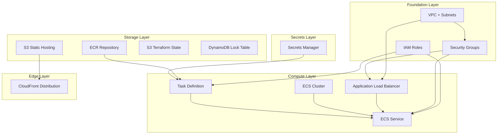
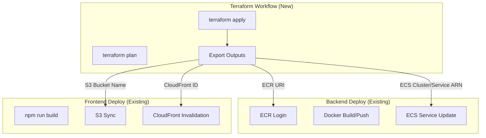
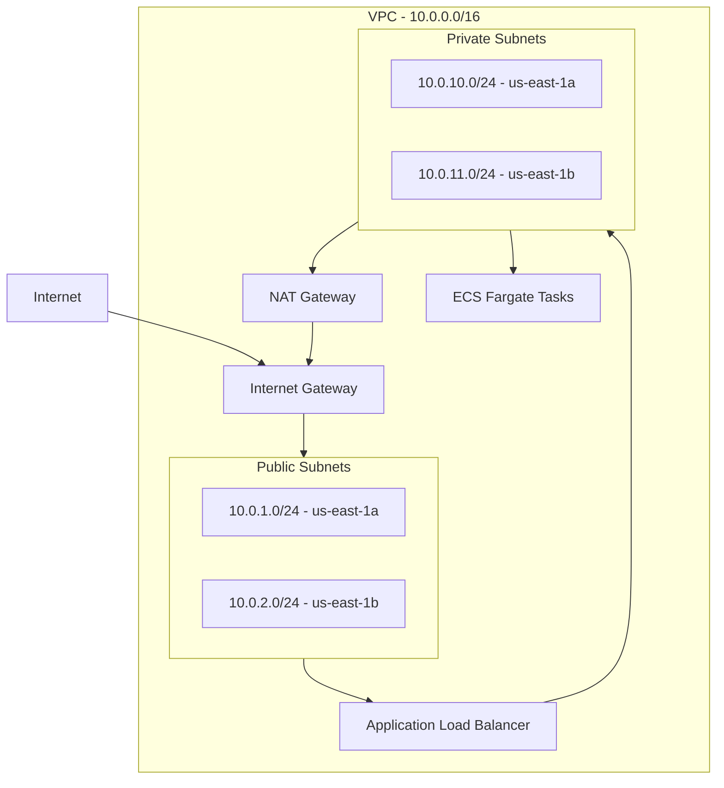
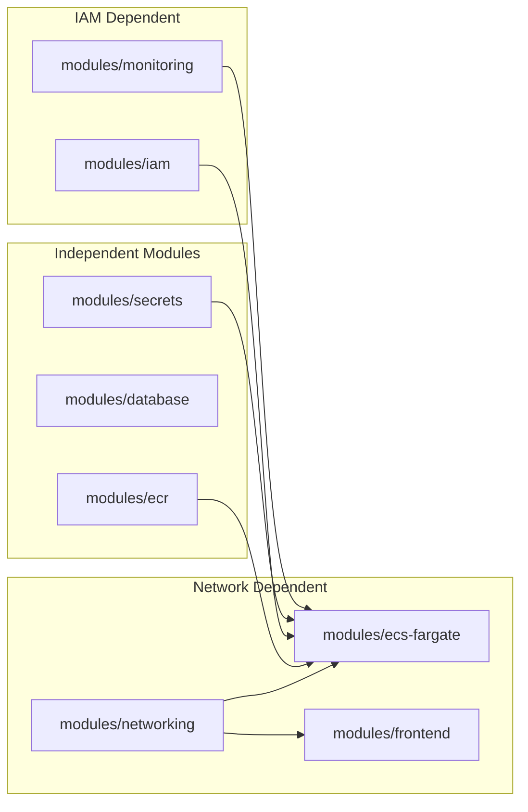
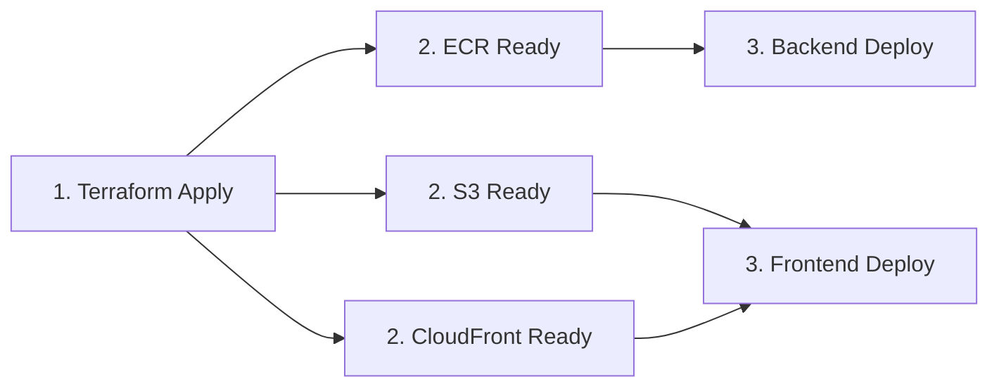

# Technical Specification

# 0. Agent Action Plan

## 0.1 Intent Clarification

### 0.1.1 Core Feature Objective

Based on the prompt, the Blitzy platform understands that the new feature requirement is to **add comprehensive Terraform infrastructure-as-code (IaC) capabilities** to automate the provisioning of AWS resources for the LangGraph Search Agent application. This feature addresses the critical infrastructure gap identified in Technical Specification Section 8.2.2.1:

> "Infrastructure Gap: The system requires manual provisioning of AWS resources (ECR repository, ECS cluster, S3 bucket, CloudFront distribution) before CI/CD pipelines can execute successfully."

**Primary Requirements:**

- Automate provisioning of all AWS infrastructure resources currently requiring manual creation
- Create modular Terraform configuration under `./infrastructure/terraform/` directory
- Implement S3 + DynamoDB state backend for team collaboration and state locking
- Configure IAM roles supporting GitHub Actions OIDC authentication (eliminating long-lived credentials)
- Support multi-environment deployments (dev, staging, prod) with environment-specific overrides
- Enable auto-scaling capabilities for ECS Fargate backend containers
- Provision CloudFront CDN with cache invalidation for frontend static assets
- Implement ECR lifecycle policies retaining only the last 10 container images
- Apply consistent resource tagging (Project, Environment, ManagedBy, Region)

**Implicit Requirements Detected:**

- VPC networking infrastructure with public/private subnets for ECS Fargate tasks
- Security groups controlling network traffic to ECS containers (port 8000)
- CloudWatch log groups for container logging (currently using AWS defaults)
- IAM task execution roles for ECS with permissions to pull from ECR
- IAM task roles for container runtime permissions (Secrets Manager access)
- Secrets Manager resources for API keys (OPENAI_API_KEY, TAVILY_API_KEY)
- Application Load Balancer for ECS service discovery and health checks
- S3 bucket policies restricting access to CloudFront Origin Access Identity

**Feature Dependencies and Prerequisites:**

| Dependency | Description | Status |
|------------|-------------|--------|
| AWS Account | Active AWS account with appropriate permissions | Required (assumed available) |
| Terraform CLI | Version >= 1.5.0 installed locally or in CI | Required |
| AWS CLI | Version >= 2.0 for credential configuration | Required |
| GitHub Repository | Repository with Actions enabled | Existing |
| Existing CI/CD Workflows | `backend-deploy.yml`, `frontend-deploy.yml` | Existing (will integrate) |

---

### 0.1.2 Special Instructions and Constraints

**Critical Directives from User Prompt:**

- **Region Constraint**: All resources MUST be provisioned in `us-east-1` exclusively (Constraint C-005)
- **Cloud Provider Constraint**: Amazon Web Services (AWS) exclusively - no multi-cloud considerations
- **Resource Naming Convention**: Must match existing CI/CD workflow expectations:
  - ECR Repository: `langgraph-search-agent-backend`
  - ECS Cluster: `langgraph-search-agent-cluster`
  - ECS Service: `langgraph-search-agent-service`
  - ECS Task Definition: `langgraph-search-agent-task`
  - S3 Bucket: `langgraph-search-agent-frontend-production`
- **DynamoDB Table**: `langgraph-conversations` (configured but unused - provision for future readiness)
- **Container Configuration**: Backend runs on port 8000 (FastAPI application)
- **Authentication Pattern**: GitHub Actions OIDC authentication - no long-lived AWS credentials

**Architectural Requirements:**

- Use Terraform modules for each infrastructure component (ECR, ECS, S3, CloudFront, IAM, etc.)
- Implement remote state with S3 backend and DynamoDB locking table
- Environment separation via workspace or directory-based configuration
- Pin Terraform version (>= 1.5.0) and AWS provider version (~> 5.0)
- Follow HashiCorp recommended module structure

**User Examples Preserved:**

User Example - Directory Structure:
```
./infrastructure/terraform/
├── main.tf
├── variables.tf
├── outputs.tf
├── terraform.tfvars
├── backend.tf
├── versions.tf
├── locals.tf
├── modules/
│   ├── ecr/
│   ├── networking/
│   ├── ecs-fargate/
│   ├── frontend/
│   ├── storage/
│   ├── database/
│   ├── monitoring/
│   ├── iam/
│   └── secrets/
└── environments/
    ├── dev/
    ├── staging/
    └── prod/
```

---

### 0.1.3 Technical Interpretation

These feature requirements translate to the following technical implementation strategy:

**Infrastructure Layer Mapping:**

| Requirement | Technical Implementation | Terraform Resource Type |
|-------------|-------------------------|------------------------|
| Container Registry | Create ECR repository with lifecycle policy | `aws_ecr_repository`, `aws_ecr_lifecycle_policy` |
| Container Orchestration | Create ECS cluster, service, task definition | `aws_ecs_cluster`, `aws_ecs_service`, `aws_ecs_task_definition` |
| Serverless Compute | Configure Fargate launch type with capacity provider | `aws_ecs_cluster_capacity_providers` |
| Static Hosting | Create S3 bucket with static website configuration | `aws_s3_bucket`, `aws_s3_bucket_website_configuration` |
| CDN Distribution | Create CloudFront distribution with S3 origin | `aws_cloudfront_distribution`, `aws_cloudfront_origin_access_identity` |
| Network Infrastructure | Create VPC, subnets, security groups | `aws_vpc`, `aws_subnet`, `aws_security_group` |
| Load Balancing | Create ALB with target groups | `aws_lb`, `aws_lb_target_group`, `aws_lb_listener` |
| Identity Management | Create IAM roles for ECS and GitHub Actions | `aws_iam_role`, `aws_iam_role_policy_attachment` |
| Secrets Management | Create Secrets Manager secrets for API keys | `aws_secretsmanager_secret` |
| Logging | Create CloudWatch log groups | `aws_cloudwatch_log_group` |
| State Management | Create S3 bucket and DynamoDB table for Terraform state | `aws_s3_bucket`, `aws_dynamodb_table` |

**Implementation Approach Summary:**

To implement automated AWS infrastructure provisioning, we will:

- **CREATE** a new `infrastructure/terraform/` directory structure with modular configuration
- **CREATE** reusable Terraform modules for each infrastructure component (ECR, ECS-Fargate, Frontend, Networking, IAM, Secrets, Monitoring, Storage, Database)
- **CREATE** environment-specific variable files for dev, staging, and production
- **CREATE** a GitHub Actions workflow for Terraform plan/apply operations on infrastructure changes
- **MODIFY** existing CI/CD workflows to depend on Terraform-provisioned resources
- **CONFIGURE** remote state backend using S3 with DynamoDB locking
- **IMPLEMENT** GitHub Actions OIDC provider for AWS authentication

**Resource Dependency Graph:**



## 0.2 Repository Scope Discovery

### 0.2.1 Comprehensive File Analysis

**Existing Repository Structure Analysis:**

The LangGraph Search Agent repository contains a Python FastAPI backend and React/Vite frontend with GitHub Actions CI/CD pipelines. The Terraform infrastructure addition requires understanding of existing integration points.

**Existing Files Requiring Modification:**

| File Path | Modification Type | Purpose |
|-----------|-------------------|---------|
| `.github/workflows/backend-deploy.yml` | UPDATE | Add Terraform outputs dependency, update resource references |
| `.github/workflows/frontend-deploy.yml` | UPDATE | Add Terraform outputs dependency, reference CloudFront ID from Terraform |
| `.gitignore` | UPDATE | Add Terraform-specific ignore patterns (`.terraform/`, `*.tfstate`, etc.) |
| `README.md` | UPDATE | Add infrastructure documentation and setup instructions |
| `SETUP.md` | UPDATE | Add Terraform prerequisites and deployment instructions |

**Existing Configuration Files (Reference Only - No Modification):**

| File Path | Purpose | Key Configuration Values |
|-----------|---------|-------------------------|
| `backend/requirements.txt` | Python dependencies | `boto3==1.35.0`, `fastapi==0.109.0` |
| `backend/app/config.py` | Application settings | `DYNAMODB_TABLE_NAME`, environment variables |
| `backend/Dockerfile` | Container definition | Port 8000, Python 3.12-slim base |
| `frontend/package.json` | Node.js dependencies | React 18, Vite 5 |
| `docker-compose.yml` | Local development | Port mappings 8000:8000, 3000:3000 |

**CI/CD Workflow Analysis:**

From `.github/workflows/backend-deploy.yml`:
- Uses hardcoded resource names that must match Terraform outputs
- Deploys to ECS cluster `langgraph-search-agent-cluster`
- Updates ECS service `langgraph-search-agent-service`
- Region: `us-east-1`

From `.github/workflows/frontend-deploy.yml`:
- Syncs to S3 bucket `langgraph-search-agent-frontend-production`
- Invalidates CloudFront distribution (ID from `CLOUDFRONT_DISTRIBUTION_ID` secret)
- Injects `VITE_API_URL` at build time

---

### 0.2.2 Integration Point Discovery

**API Endpoints Connecting to Infrastructure:**

| Component | Endpoint | Infrastructure Dependency |
|-----------|----------|--------------------------|
| Backend Health | `GET /health` | ECS Service health check target |
| Backend Query | `POST /query` | ALB routing, ECS task execution |
| Frontend Assets | `/*` | S3 bucket, CloudFront distribution |

**Database/Storage Integration Points:**

| Resource | Current State | Terraform Provision |
|----------|---------------|---------------------|
| DynamoDB Table | Configured in code, not created | Create `langgraph-conversations` table |
| S3 Static Bucket | Referenced in CI/CD, not created | Create with static hosting enabled |
| ECR Repository | Referenced in CI/CD, not created | Create with lifecycle policy |

**Service Configuration Dependencies:**

| Configuration | Source | Terraform Integration |
|---------------|--------|----------------------|
| `OPENAI_API_KEY` | GitHub Secrets → ECS Env | Secrets Manager secret |
| `TAVILY_API_KEY` | GitHub Secrets → ECS Env | Secrets Manager secret |
| `CORS_ORIGINS` | Environment variable | ECS task definition |
| `DYNAMODB_TABLE_NAME` | Environment variable | ECS task definition |
| `AWS_REGION` | Environment variable | ECS task definition |

---

### 0.2.3 New File Requirements

**New Source Files to Create:**

| File Path | Purpose |
|-----------|---------|
| `infrastructure/terraform/main.tf` | Root module orchestrating all child modules |
| `infrastructure/terraform/variables.tf` | Input variable declarations |
| `infrastructure/terraform/outputs.tf` | Output values for CI/CD consumption |
| `infrastructure/terraform/backend.tf` | S3 + DynamoDB state backend configuration |
| `infrastructure/terraform/versions.tf` | Terraform and provider version constraints |
| `infrastructure/terraform/locals.tf` | Local values and computed variables |
| `infrastructure/terraform/terraform.tfvars.example` | Example variable values (template) |

**Module Files to Create:**

| Module Path | Files | Purpose |
|-------------|-------|---------|
| `infrastructure/terraform/modules/ecr/` | `main.tf`, `variables.tf`, `outputs.tf` | ECR repository with lifecycle policy |
| `infrastructure/terraform/modules/networking/` | `main.tf`, `variables.tf`, `outputs.tf` | VPC, subnets, security groups |
| `infrastructure/terraform/modules/ecs-fargate/` | `main.tf`, `variables.tf`, `outputs.tf` | ECS cluster, service, task definition, ALB |
| `infrastructure/terraform/modules/frontend/` | `main.tf`, `variables.tf`, `outputs.tf` | S3 bucket + CloudFront distribution |
| `infrastructure/terraform/modules/storage/` | `main.tf`, `variables.tf`, `outputs.tf` | S3 buckets for logs and artifacts |
| `infrastructure/terraform/modules/database/` | `main.tf`, `variables.tf`, `outputs.tf` | DynamoDB table (future-ready) |
| `infrastructure/terraform/modules/monitoring/` | `main.tf`, `variables.tf`, `outputs.tf` | CloudWatch log groups and alarms |
| `infrastructure/terraform/modules/iam/` | `main.tf`, `variables.tf`, `outputs.tf` | IAM roles for ECS and GitHub Actions OIDC |
| `infrastructure/terraform/modules/secrets/` | `main.tf`, `variables.tf`, `outputs.tf` | Secrets Manager resources |

**Environment-Specific Configuration:**

| File Path | Purpose |
|-----------|---------|
| `infrastructure/terraform/environments/dev/main.tf` | Development environment root |
| `infrastructure/terraform/environments/dev/terraform.tfvars` | Development variable values |
| `infrastructure/terraform/environments/staging/main.tf` | Staging environment root |
| `infrastructure/terraform/environments/staging/terraform.tfvars` | Staging variable values |
| `infrastructure/terraform/environments/prod/main.tf` | Production environment root |
| `infrastructure/terraform/environments/prod/terraform.tfvars` | Production variable values |

**New CI/CD Workflow to Create:**

| File Path | Purpose |
|-----------|---------|
| `.github/workflows/terraform.yml` | Terraform plan on PR, apply on merge to main |

**Documentation Files to Create:**

| File Path | Purpose |
|-----------|---------|
| `infrastructure/terraform/README.md` | Terraform usage documentation |
| `infrastructure/terraform/.terraform-version` | Terraform version pinning for tfenv |

---

### 0.2.4 Web Search Research Conducted

**Best Practices Research:**

| Topic | Key Findings |
|-------|--------------|
| Terraform AWS Provider Version | Latest stable: ~> 5.0 (as of December 2024, v5.x is recommended for stability) |
| Terraform CLI Version | Latest stable: 1.9.x; recommend >= 1.5.0 for compatibility |
| ECS Fargate Terraform Patterns | Use `aws_ecs_cluster_capacity_providers` for Fargate; implement ALB health checks |
| GitHub Actions OIDC | Use `aws_iam_openid_connect_provider` with GitHub's OIDC thumbprint |
| S3 State Backend | Enable versioning and encryption; use DynamoDB for locking |
| CloudFront with S3 | Use Origin Access Identity (OAI) for secure S3 access |

**Security Considerations:**

| Aspect | Implementation Recommendation |
|--------|------------------------------|
| State File Security | Enable S3 bucket encryption, restrict access via bucket policy |
| Secrets in Terraform | Use `sensitive = true` for outputs; reference Secrets Manager ARNs |
| IAM Least Privilege | Create specific roles for ECS task execution vs. task role |
| OIDC Authentication | Configure trust policy with specific repository and branch conditions |

---

### 0.2.5 Complete File Inventory

**Files to CREATE (Total: 48+ files):**

```
infrastructure/terraform/
├── main.tf
├── variables.tf
├── outputs.tf
├── backend.tf
├── versions.tf
├── locals.tf
├── terraform.tfvars.example
├── README.md
├── .terraform-version
├── modules/
│   ├── ecr/
│   │   ├── main.tf
│   │   ├── variables.tf
│   │   └── outputs.tf
│   ├── networking/
│   │   ├── main.tf
│   │   ├── variables.tf
│   │   └── outputs.tf
│   ├── ecs-fargate/
│   │   ├── main.tf
│   │   ├── variables.tf
│   │   └── outputs.tf
│   ├── frontend/
│   │   ├── main.tf
│   │   ├── variables.tf
│   │   └── outputs.tf
│   ├── storage/
│   │   ├── main.tf
│   │   ├── variables.tf
│   │   └── outputs.tf
│   ├── database/
│   │   ├── main.tf
│   │   ├── variables.tf
│   │   └── outputs.tf
│   ├── monitoring/
│   │   ├── main.tf
│   │   ├── variables.tf
│   │   └── outputs.tf
│   ├── iam/
│   │   ├── main.tf
│   │   ├── variables.tf
│   │   └── outputs.tf
│   └── secrets/
│       ├── main.tf
│       ├── variables.tf
│       └── outputs.tf
└── environments/
    ├── dev/
    │   ├── main.tf
    │   └── terraform.tfvars
    ├── staging/
    │   ├── main.tf
    │   └── terraform.tfvars
    └── prod/
        ├── main.tf
        └── terraform.tfvars

.github/workflows/
└── terraform.yml
```

**Files to MODIFY (Total: 5 files):**

| File | Modification |
|------|--------------|
| `.github/workflows/backend-deploy.yml` | Add Terraform state dependency check |
| `.github/workflows/frontend-deploy.yml` | Reference CloudFront ID from Terraform output |
| `.gitignore` | Add Terraform patterns |
| `README.md` | Add infrastructure section |
| `SETUP.md` | Add Terraform setup instructions |

## 0.3 Dependency Inventory

### 0.3.1 Private and Public Packages

**Terraform Provider Dependencies:**

| Registry | Package Name | Version | Purpose |
|----------|--------------|---------|---------|
| HashiCorp | `hashicorp/terraform` | `>= 1.5.0` | Terraform CLI version constraint |
| HashiCorp | `hashicorp/aws` | `~> 5.0` | AWS provider for resource management |
| HashiCorp | `hashicorp/random` | `~> 3.5` | Random string generation for unique naming |

**AWS Service Dependencies (Provisioned by Terraform):**

| AWS Service | Resource Type | Version/API | Purpose |
|-------------|---------------|-------------|---------|
| ECR | Container Registry | Latest | Docker image storage |
| ECS | Fargate | Latest | Serverless container orchestration |
| EC2 | VPC, Subnets, Security Groups | Latest | Network infrastructure |
| ELB | Application Load Balancer | v2 | Traffic distribution |
| S3 | Object Storage | Latest | Static hosting, state backend |
| CloudFront | CDN | Latest | Content delivery |
| DynamoDB | NoSQL Database | Latest | State locking, future app data |
| IAM | Identity Management | Latest | Roles and policies |
| Secrets Manager | Secret Storage | Latest | API key management |
| CloudWatch | Logging/Monitoring | Latest | Container logs |

**Existing Application Dependencies (Reference - No Changes):**

| Package | Current Version | Source File |
|---------|-----------------|-------------|
| `boto3` | `1.35.0` | `backend/requirements.txt` |
| `fastapi` | `0.109.0` | `backend/requirements.txt` |
| `langgraph` | `0.2.28` | `backend/requirements.txt` |
| `uvicorn` | `0.27.0` | `backend/requirements.txt` |
| `react` | `18.2.0` | `frontend/package.json` |
| `vite` | `5.0.8` | `frontend/package.json` |

---

### 0.3.2 Terraform Version Constraints

**versions.tf Configuration:**

```hcl
terraform {
  required_version = ">= 1.5.0"
  
  required_providers {
    aws = {
      source  = "hashicorp/aws"
      version = "~> 5.0"
    }
    random = {
      source  = "hashicorp/random"
      version = "~> 3.5"
    }
  }
}
```

**Version Selection Rationale:**

| Constraint | Selection | Rationale |
|------------|-----------|-----------|
| Terraform >= 1.5.0 | Minimum stable version | Supports `import` blocks, `check` blocks, modern HCL features |
| AWS Provider ~> 5.0 | Major version 5.x | Latest stable major version with full ECS Fargate support |
| Random Provider ~> 3.5 | Patch version flexibility | Stable API for unique suffix generation |

---

### 0.3.3 CI/CD Dependency Updates

**GitHub Actions Workflow Dependencies:**

| Dependency | Version | Workflow | Purpose |
|------------|---------|----------|---------|
| `actions/checkout` | `v4` | All workflows | Repository checkout |
| `aws-actions/configure-aws-credentials` | `v4` | All workflows | AWS OIDC authentication |
| `hashicorp/setup-terraform` | `v3` | `terraform.yml` | Terraform CLI installation |
| `aws-actions/amazon-ecr-login` | `v2` | `backend-deploy.yml` | ECR authentication |

**New Workflow: terraform.yml Dependencies:**

```yaml
# Required GitHub Actions
- actions/checkout@v4
- aws-actions/configure-aws-credentials@v4
- hashicorp/setup-terraform@v3
```

---

### 0.3.4 Import Updates

**No Python/JavaScript import changes required.** The Terraform infrastructure operates independently of application code.

**Terraform Module Import Pattern:**

Each root configuration will import modules using relative paths:

```hcl
module "ecr" {
  source = "./modules/ecr"
  # variables...
}

module "networking" {
  source = "./modules/networking"
  # variables...
}
```

---

### 0.3.5 External Reference Updates

**Configuration Files Requiring Updates:**

| File | Update Type | Change Description |
|------|-------------|-------------------|
| `.gitignore` | Addition | Add Terraform-specific patterns |

**Gitignore Additions:**

```gitignore
# Terraform
**/.terraform/
*.tfstate
*.tfstate.*
*.tfvars
!*.tfvars.example
*.tfplan
.terraform.lock.hcl
crash.log
override.tf
override.tf.json
*_override.tf
*_override.tf.json
```

**CI/CD Workflow Updates:**

| Workflow File | Section | Change |
|---------------|---------|--------|
| `.github/workflows/backend-deploy.yml` | Environment | Reference Terraform outputs for ECR URI |
| `.github/workflows/frontend-deploy.yml` | Environment | Reference Terraform outputs for CloudFront ID |

**Documentation Updates:**

| File | Section | Change Description |
|------|---------|-------------------|
| `README.md` | New Section | Add "Infrastructure" section with Terraform usage |
| `SETUP.md` | Prerequisites | Add Terraform CLI requirements |
| `SETUP.md` | Deployment | Add infrastructure deployment instructions |

---

### 0.3.6 AWS Resource Naming Convention

**Terraform Resource Naming Pattern:**

All resources follow the pattern: `{project}-{component}-{environment}`

| Resource Type | Naming Pattern | Example (Production) |
|---------------|----------------|---------------------|
| ECR Repository | `{project}-backend` | `langgraph-search-agent-backend` |
| ECS Cluster | `{project}-cluster` | `langgraph-search-agent-cluster` |
| ECS Service | `{project}-service` | `langgraph-search-agent-service` |
| ECS Task Definition | `{project}-task` | `langgraph-search-agent-task` |
| S3 Frontend Bucket | `{project}-frontend-{env}` | `langgraph-search-agent-frontend-production` |
| S3 State Bucket | `{project}-terraform-state` | `langgraph-search-agent-terraform-state` |
| DynamoDB Lock Table | `{project}-terraform-locks` | `langgraph-search-agent-terraform-locks` |
| DynamoDB App Table | `langgraph-conversations` | `langgraph-conversations` |
| VPC | `{project}-vpc` | `langgraph-search-agent-vpc` |
| ALB | `{project}-alb` | `langgraph-search-agent-alb` |
| CloudWatch Log Group | `/ecs/{project}` | `/ecs/langgraph-search-agent` |

**Resource Tagging Standard:**

All resources will include the following tags:

```hcl
locals {
  common_tags = {
    Project     = "langgraph-search-agent"
    Environment = var.environment
    ManagedBy   = "terraform"
    Region      = var.aws_region
  }
}
```

## 0.4 Integration Analysis

### 0.4.1 Existing Code Touchpoints

**Direct Modifications Required:**

| File | Line Reference | Modification Description |
|------|----------------|-------------------------|
| `.github/workflows/backend-deploy.yml` | Lines 24-45 | Update to read ECR repository URI from Terraform outputs or use dynamic data |
| `.github/workflows/frontend-deploy.yml` | Lines 31-35 | Read CloudFront distribution ID from Terraform state or outputs |
| `.gitignore` | End of file | Append Terraform-specific ignore patterns |
| `README.md` | New section | Add infrastructure overview and deployment instructions |
| `SETUP.md` | Prerequisites | Add Terraform CLI and AWS requirements |

**CI/CD Integration Points:**



---

### 0.4.2 Dependency Injections

**Environment Variable Flow:**

| Variable | Source | Target | Terraform Resource |
|----------|--------|--------|-------------------|
| `OPENAI_API_KEY` | GitHub Secrets | ECS Task Environment | `aws_secretsmanager_secret` |
| `TAVILY_API_KEY` | GitHub Secrets | ECS Task Environment | `aws_secretsmanager_secret` |
| `AWS_REGION` | Terraform Variable | ECS Task Environment | Task Definition |
| `DYNAMODB_TABLE_NAME` | Terraform Output | ECS Task Environment | Task Definition |
| `CORS_ORIGINS` | Terraform Variable | ECS Task Environment | Task Definition |

**IAM Role Dependencies:**

| Role | Trust Policy | Permissions | Usage |
|------|--------------|-------------|-------|
| ECS Task Execution Role | `ecs-tasks.amazonaws.com` | ECR pull, CloudWatch logs, Secrets Manager read | Task startup |
| ECS Task Role | `ecs-tasks.amazonaws.com` | DynamoDB access (future) | Container runtime |
| GitHub Actions OIDC Role | `token.actions.githubusercontent.com` | ECS deploy, ECR push, S3 sync, CloudFront invalidate | CI/CD pipelines |

**Role Trust Relationship:**

```json
{
  "Version": "2012-10-17",
  "Statement": [
    {
      "Effect": "Allow",
      "Principal": {
        "Federated": "arn:aws:iam::ACCOUNT_ID:oidc-provider/token.actions.githubusercontent.com"
      },
      "Action": "sts:AssumeRoleWithWebIdentity",
      "Condition": {
        "StringEquals": {
          "token.actions.githubusercontent.com:aud": "sts.amazonaws.com"
        },
        "StringLike": {
          "token.actions.githubusercontent.com:sub": "repo:OWNER/REPO:*"
        }
      }
    }
  ]
}
```

---

### 0.4.3 Database/Schema Updates

**DynamoDB Table Creation (Future-Ready):**

The `langgraph-conversations` table is configured in application code but not currently used. Terraform will provision this table for future integration:

| Attribute | Configuration | Rationale |
|-----------|---------------|-----------|
| Table Name | `langgraph-conversations` | Matches `backend/app/config.py` |
| Partition Key | `session_id` (String) | Session-based access pattern |
| Sort Key | `timestamp` (Number) | Chronological message ordering |
| Billing Mode | PAY_PER_REQUEST | On-demand scaling for variable load |
| TTL Attribute | `expiration` | Automatic cleanup of old sessions |

**Terraform State Backend:**

| Resource | Purpose | Configuration |
|----------|---------|---------------|
| S3 Bucket | State file storage | Versioning enabled, encryption enabled |
| DynamoDB Table | State locking | `LockID` partition key |

---

### 0.4.4 Network Integration

**VPC Architecture:**



**Security Group Rules:**

| Security Group | Inbound Rules | Outbound Rules | Attached To |
|----------------|---------------|----------------|-------------|
| ALB SG | 80 (HTTP), 443 (HTTPS) from 0.0.0.0/0 | All traffic to ECS SG | Application Load Balancer |
| ECS SG | 8000 from ALB SG | 443 to 0.0.0.0/0 (APIs) | ECS Fargate Tasks |

---

### 0.4.5 Module Dependency Graph

**Terraform Module Dependencies:**



**Module Output Dependencies:**

| Producing Module | Output | Consuming Module | Variable |
|------------------|--------|------------------|----------|
| `networking` | `vpc_id` | `ecs-fargate` | `vpc_id` |
| `networking` | `private_subnet_ids` | `ecs-fargate` | `subnet_ids` |
| `networking` | `alb_security_group_id` | `ecs-fargate` | `alb_security_group_id` |
| `ecr` | `repository_url` | `ecs-fargate` | `container_image` |
| `iam` | `task_execution_role_arn` | `ecs-fargate` | `execution_role_arn` |
| `iam` | `task_role_arn` | `ecs-fargate` | `task_role_arn` |
| `secrets` | `openai_secret_arn` | `ecs-fargate` | `secrets` |
| `secrets` | `tavily_secret_arn` | `ecs-fargate` | `secrets` |
| `monitoring` | `log_group_name` | `ecs-fargate` | `log_group_name` |
| `frontend` | `cloudfront_distribution_id` | Root outputs | CI/CD reference |
| `frontend` | `s3_bucket_name` | Root outputs | CI/CD reference |

---

### 0.4.6 GitHub Actions OIDC Integration

**OIDC Provider Configuration:**

| Attribute | Value |
|-----------|-------|
| Provider URL | `https://token.actions.githubusercontent.com` |
| Audience | `sts.amazonaws.com` |
| Thumbprint | GitHub OIDC thumbprint (dynamic) |

**Workflow Authentication Update:**

```yaml
# .github/workflows/backend-deploy.yml
permissions:
  id-token: write
  contents: read

jobs:
  deploy:
    steps:
      - uses: aws-actions/configure-aws-credentials@v4
        with:
          role-to-assume: ${{ secrets.AWS_ROLE_ARN }}
          aws-region: us-east-1
```

**Required GitHub Secrets (Post-Terraform):**

| Secret Name | Description | Source |
|-------------|-------------|--------|
| `AWS_ROLE_ARN` | GitHub Actions OIDC role ARN | Terraform output |
| `OPENAI_API_KEY` | OpenAI API key | User-provided |
| `TAVILY_API_KEY` | Tavily API key | User-provided |

## 0.5 Technical Implementation

### 0.5.1 File-by-File Execution Plan

**CRITICAL: Every file listed below MUST be created or modified.**

---

#### Group 1 - Terraform Foundation (Root Configuration)

| Action | File Path | Implementation Details |
|--------|-----------|----------------------|
| CREATE | `infrastructure/terraform/versions.tf` | Define Terraform and provider version constraints |
| CREATE | `infrastructure/terraform/backend.tf` | Configure S3 + DynamoDB state backend |
| CREATE | `infrastructure/terraform/variables.tf` | Declare all input variables with types and defaults |
| CREATE | `infrastructure/terraform/locals.tf` | Define common tags, computed values, naming conventions |
| CREATE | `infrastructure/terraform/main.tf` | Orchestrate all child modules with proper dependencies |
| CREATE | `infrastructure/terraform/outputs.tf` | Export values for CI/CD consumption (sensitive outputs marked) |
| CREATE | `infrastructure/terraform/terraform.tfvars.example` | Template variable values for user customization |
| CREATE | `infrastructure/terraform/.terraform-version` | Pin Terraform version for tfenv compatibility |
| CREATE | `infrastructure/terraform/README.md` | Usage documentation, prerequisites, examples |

---

#### Group 2 - ECR Module

| Action | File Path | Implementation Details |
|--------|-----------|----------------------|
| CREATE | `infrastructure/terraform/modules/ecr/main.tf` | ECR repository with image scanning, lifecycle policy (retain 10 images) |
| CREATE | `infrastructure/terraform/modules/ecr/variables.tf` | Repository name, scan on push setting, lifecycle rules |
| CREATE | `infrastructure/terraform/modules/ecr/outputs.tf` | Repository URL, ARN for IAM policies |

**Key Resources:**
- `aws_ecr_repository` - Container image repository
- `aws_ecr_lifecycle_policy` - Retain last 10 tagged images

---

#### Group 3 - Networking Module

| Action | File Path | Implementation Details |
|--------|-----------|----------------------|
| CREATE | `infrastructure/terraform/modules/networking/main.tf` | VPC, subnets (2 public, 2 private), IGW, NAT GW, route tables, security groups |
| CREATE | `infrastructure/terraform/modules/networking/variables.tf` | VPC CIDR, subnet CIDRs, availability zones |
| CREATE | `infrastructure/terraform/modules/networking/outputs.tf` | VPC ID, subnet IDs, security group IDs |

**Key Resources:**
- `aws_vpc` - Primary VPC (10.0.0.0/16)
- `aws_subnet` - 4 subnets across 2 AZs
- `aws_internet_gateway` - Internet access
- `aws_nat_gateway` - Outbound access for private subnets
- `aws_route_table` - Routing configuration
- `aws_security_group` - ALB and ECS security groups

---

#### Group 4 - IAM Module

| Action | File Path | Implementation Details |
|--------|-----------|----------------------|
| CREATE | `infrastructure/terraform/modules/iam/main.tf` | ECS execution role, task role, GitHub Actions OIDC provider and role |
| CREATE | `infrastructure/terraform/modules/iam/variables.tf` | GitHub repository, role names, policy attachments |
| CREATE | `infrastructure/terraform/modules/iam/outputs.tf` | Role ARNs for ECS and CI/CD consumption |

**Key Resources:**
- `aws_iam_openid_connect_provider` - GitHub Actions OIDC
- `aws_iam_role` - ECS task execution, ECS task, GitHub Actions
- `aws_iam_role_policy_attachment` - Managed policy attachments
- `aws_iam_role_policy` - Inline policies for specific permissions

---

#### Group 5 - Secrets Module

| Action | File Path | Implementation Details |
|--------|-----------|----------------------|
| CREATE | `infrastructure/terraform/modules/secrets/main.tf` | Secrets Manager secrets for API keys (placeholder values) |
| CREATE | `infrastructure/terraform/modules/secrets/variables.tf` | Secret names, descriptions |
| CREATE | `infrastructure/terraform/modules/secrets/outputs.tf` | Secret ARNs for ECS task definition |

**Key Resources:**
- `aws_secretsmanager_secret` - Secret containers
- `aws_secretsmanager_secret_version` - Initial placeholder values

---

#### Group 6 - Monitoring Module

| Action | File Path | Implementation Details |
|--------|-----------|----------------------|
| CREATE | `infrastructure/terraform/modules/monitoring/main.tf` | CloudWatch log group, optional alarms, dashboard |
| CREATE | `infrastructure/terraform/modules/monitoring/variables.tf` | Log group name, retention days, alarm thresholds |
| CREATE | `infrastructure/terraform/modules/monitoring/outputs.tf` | Log group name and ARN |

**Key Resources:**
- `aws_cloudwatch_log_group` - ECS container logs
- `aws_cloudwatch_metric_alarm` - CPU/Memory alerts (optional)

---

#### Group 7 - ECS Fargate Module

| Action | File Path | Implementation Details |
|--------|-----------|----------------------|
| CREATE | `infrastructure/terraform/modules/ecs-fargate/main.tf` | ECS cluster, service, task definition, ALB, target group, listener |
| CREATE | `infrastructure/terraform/modules/ecs-fargate/variables.tf` | Container settings, scaling config, health check settings |
| CREATE | `infrastructure/terraform/modules/ecs-fargate/outputs.tf` | Cluster ARN, service ARN, ALB DNS name |

**Key Resources:**
- `aws_ecs_cluster` - Fargate cluster
- `aws_ecs_cluster_capacity_providers` - Fargate capacity provider
- `aws_ecs_task_definition` - Container configuration (port 8000)
- `aws_ecs_service` - Service with desired count, load balancer attachment
- `aws_lb` - Application Load Balancer
- `aws_lb_target_group` - Health check on `/health`
- `aws_lb_listener` - HTTP listener (port 80)
- `aws_appautoscaling_target` - Auto-scaling target
- `aws_appautoscaling_policy` - CPU-based scaling policy

---

#### Group 8 - Frontend Module

| Action | File Path | Implementation Details |
|--------|-----------|----------------------|
| CREATE | `infrastructure/terraform/modules/frontend/main.tf` | S3 bucket with static hosting, CloudFront distribution, OAI |
| CREATE | `infrastructure/terraform/modules/frontend/variables.tf` | Bucket name, domain settings, cache behavior |
| CREATE | `infrastructure/terraform/modules/frontend/outputs.tf` | S3 bucket name, CloudFront distribution ID and domain |

**Key Resources:**
- `aws_s3_bucket` - Static asset storage
- `aws_s3_bucket_website_configuration` - Static hosting settings
- `aws_s3_bucket_policy` - CloudFront OAI access
- `aws_cloudfront_origin_access_identity` - Secure S3 access
- `aws_cloudfront_distribution` - CDN distribution

---

#### Group 9 - Storage Module

| Action | File Path | Implementation Details |
|--------|-----------|----------------------|
| CREATE | `infrastructure/terraform/modules/storage/main.tf` | S3 buckets for Terraform state and application logs |
| CREATE | `infrastructure/terraform/modules/storage/variables.tf` | Bucket names, versioning settings |
| CREATE | `infrastructure/terraform/modules/storage/outputs.tf` | Bucket names and ARNs |

**Key Resources:**
- `aws_s3_bucket` - Terraform state bucket
- `aws_s3_bucket_versioning` - State versioning
- `aws_s3_bucket_server_side_encryption_configuration` - Encryption
- `aws_dynamodb_table` - Terraform state locking

---

#### Group 10 - Database Module

| Action | File Path | Implementation Details |
|--------|-----------|----------------------|
| CREATE | `infrastructure/terraform/modules/database/main.tf` | DynamoDB table for future session persistence |
| CREATE | `infrastructure/terraform/modules/database/variables.tf` | Table name, key schema, TTL settings |
| CREATE | `infrastructure/terraform/modules/database/outputs.tf` | Table name and ARN |

**Key Resources:**
- `aws_dynamodb_table` - `langgraph-conversations` table
- TTL configuration for automatic session expiry

---

#### Group 11 - Environment Configurations

| Action | File Path | Implementation Details |
|--------|-----------|----------------------|
| CREATE | `infrastructure/terraform/environments/dev/main.tf` | Development environment module invocation |
| CREATE | `infrastructure/terraform/environments/dev/terraform.tfvars` | Development variable values (smaller instances) |
| CREATE | `infrastructure/terraform/environments/staging/main.tf` | Staging environment module invocation |
| CREATE | `infrastructure/terraform/environments/staging/terraform.tfvars` | Staging variable values |
| CREATE | `infrastructure/terraform/environments/prod/main.tf` | Production environment module invocation |
| CREATE | `infrastructure/terraform/environments/prod/terraform.tfvars` | Production variable values (full capacity) |

---

#### Group 12 - CI/CD Integration

| Action | File Path | Implementation Details |
|--------|-----------|----------------------|
| CREATE | `.github/workflows/terraform.yml` | Terraform plan on PR, apply on merge to main |
| MODIFY | `.github/workflows/backend-deploy.yml` | Update to use OIDC authentication |
| MODIFY | `.github/workflows/frontend-deploy.yml` | Reference Terraform outputs for CloudFront ID |
| MODIFY | `.gitignore` | Add Terraform-specific patterns |

---

#### Group 13 - Documentation

| Action | File Path | Implementation Details |
|--------|-----------|----------------------|
| CREATE | `infrastructure/terraform/README.md` | Comprehensive Terraform usage guide |
| MODIFY | `README.md` | Add infrastructure overview section |
| MODIFY | `SETUP.md` | Add Terraform prerequisites and deployment steps |

---

### 0.5.2 Implementation Approach per File

**Phase 1: Establish Foundation**
- Create root configuration files (`versions.tf`, `backend.tf`, `variables.tf`, `locals.tf`)
- Create independent modules (ECR, Database, Secrets, Storage)
- Bootstrap state backend (manual S3/DynamoDB creation or local state initially)

**Phase 2: Build Infrastructure Layers**
- Create Networking module (VPC, subnets, security groups)
- Create IAM module (roles, policies, OIDC provider)
- Create Monitoring module (CloudWatch log groups)

**Phase 3: Deploy Compute and Edge**
- Create ECS Fargate module (cluster, service, task definition, ALB)
- Create Frontend module (S3, CloudFront)
- Wire all module dependencies in `main.tf`

**Phase 4: CI/CD Integration**
- Create Terraform workflow for automated plan/apply
- Update existing workflows to use OIDC authentication
- Export required outputs for downstream workflows

**Phase 5: Documentation and Validation**
- Create comprehensive README documentation
- Update project setup instructions
- Validate complete infrastructure deployment

## 0.6 Scope Boundaries

### 0.6.1 Exhaustively In Scope

**All Terraform Source Files:**

| Pattern | Description |
|---------|-------------|
| `infrastructure/terraform/*.tf` | Root Terraform configuration files |
| `infrastructure/terraform/modules/**/*.tf` | All module configuration files |
| `infrastructure/terraform/environments/**/*.tf` | Environment-specific configurations |
| `infrastructure/terraform/environments/**/*.tfvars` | Environment variable values |
| `infrastructure/terraform/*.tfvars.example` | Example variable files |
| `infrastructure/terraform/README.md` | Infrastructure documentation |
| `infrastructure/terraform/.terraform-version` | Terraform version file |

**CI/CD Workflow Files:**

| File Path | Scope |
|-----------|-------|
| `.github/workflows/terraform.yml` | New - Complete file creation |
| `.github/workflows/backend-deploy.yml` | Modification - OIDC auth, output references |
| `.github/workflows/frontend-deploy.yml` | Modification - OIDC auth, CloudFront ID reference |

**Configuration Files:**

| File Path | Scope |
|-----------|-------|
| `.gitignore` | Addition - Terraform patterns |

**Documentation Files:**

| File Path | Scope |
|-----------|-------|
| `infrastructure/terraform/README.md` | New - Complete documentation |
| `README.md` | Modification - Infrastructure section |
| `SETUP.md` | Modification - Terraform prerequisites |

---

### 0.6.2 AWS Resources In Scope

**Compute Resources:**

| Resource | Terraform Resource Type | Name Pattern |
|----------|------------------------|--------------|
| ECS Cluster | `aws_ecs_cluster` | `langgraph-search-agent-cluster` |
| ECS Service | `aws_ecs_service` | `langgraph-search-agent-service` |
| ECS Task Definition | `aws_ecs_task_definition` | `langgraph-search-agent-task` |
| Application Load Balancer | `aws_lb` | `langgraph-search-agent-alb` |
| Target Group | `aws_lb_target_group` | `langgraph-search-agent-tg` |

**Storage Resources:**

| Resource | Terraform Resource Type | Name Pattern |
|----------|------------------------|--------------|
| ECR Repository | `aws_ecr_repository` | `langgraph-search-agent-backend` |
| S3 Frontend Bucket | `aws_s3_bucket` | `langgraph-search-agent-frontend-{env}` |
| S3 State Bucket | `aws_s3_bucket` | `langgraph-search-agent-terraform-state` |
| DynamoDB App Table | `aws_dynamodb_table` | `langgraph-conversations` |
| DynamoDB Lock Table | `aws_dynamodb_table` | `langgraph-search-agent-terraform-locks` |

**Network Resources:**

| Resource | Terraform Resource Type | Name Pattern |
|----------|------------------------|--------------|
| VPC | `aws_vpc` | `langgraph-search-agent-vpc` |
| Public Subnets | `aws_subnet` | `langgraph-search-agent-public-{az}` |
| Private Subnets | `aws_subnet` | `langgraph-search-agent-private-{az}` |
| Internet Gateway | `aws_internet_gateway` | `langgraph-search-agent-igw` |
| NAT Gateway | `aws_nat_gateway` | `langgraph-search-agent-nat` |
| ALB Security Group | `aws_security_group` | `langgraph-search-agent-alb-sg` |
| ECS Security Group | `aws_security_group` | `langgraph-search-agent-ecs-sg` |

**CDN Resources:**

| Resource | Terraform Resource Type | Purpose |
|----------|------------------------|---------|
| CloudFront Distribution | `aws_cloudfront_distribution` | Frontend CDN |
| Origin Access Identity | `aws_cloudfront_origin_access_identity` | S3 secure access |

**Identity Resources:**

| Resource | Terraform Resource Type | Purpose |
|----------|------------------------|---------|
| OIDC Provider | `aws_iam_openid_connect_provider` | GitHub Actions auth |
| GitHub Actions Role | `aws_iam_role` | CI/CD permissions |
| ECS Task Execution Role | `aws_iam_role` | Task startup permissions |
| ECS Task Role | `aws_iam_role` | Container runtime permissions |

**Secrets Resources:**

| Resource | Terraform Resource Type | Purpose |
|----------|------------------------|---------|
| OpenAI API Secret | `aws_secretsmanager_secret` | OpenAI key storage |
| Tavily API Secret | `aws_secretsmanager_secret` | Tavily key storage |

**Monitoring Resources:**

| Resource | Terraform Resource Type | Purpose |
|----------|------------------------|---------|
| ECS Log Group | `aws_cloudwatch_log_group` | Container logging |
| CPU Alarm | `aws_cloudwatch_metric_alarm` | High CPU alert (optional) |
| Memory Alarm | `aws_cloudwatch_metric_alarm` | High memory alert (optional) |

---

### 0.6.3 Explicitly Out of Scope

**Application Code Changes:**

| Item | Rationale |
|------|-----------|
| `backend/app/**/*.py` | No application logic changes required |
| `frontend/src/**/*.jsx` | No frontend code changes required |
| `backend/requirements.txt` | No new dependencies needed |
| `frontend/package.json` | No new dependencies needed |
| `backend/Dockerfile` | Container definition unchanged |
| `frontend/Dockerfile.dev` | Development container unchanged |
| `docker-compose.yml` | Local development unchanged |

**Infrastructure Not Required:**

| Item | Rationale |
|------|-----------|
| Multi-region deployment | Single region (us-east-1) per requirements |
| Route 53 DNS configuration | No custom domain requirement specified |
| ACM SSL certificates | CloudFront provides default certificate |
| WAF configuration | Not specified in requirements |
| AWS Config rules | Not specified in requirements |
| VPN/Direct Connect | Public internet access only |
| RDS/Aurora databases | DynamoDB only (not actively used) |
| ElastiCache/Redis | In-memory state via MemorySaver |
| SQS/SNS queues | No async processing requirements |
| Lambda functions | ECS Fargate only |
| API Gateway | ALB handles routing |
| Cognito user pools | No authentication per scope |

**Advanced Features Deferred:**

| Feature | Status | Rationale |
|---------|--------|-----------|
| Blue/Green deployments | Out of scope | Rolling updates sufficient |
| Canary deployments | Out of scope | Not specified in requirements |
| Multi-account setup | Out of scope | Single account deployment |
| AWS Organizations | Out of scope | Single account |
| Service Mesh (App Mesh) | Out of scope | Direct ALB routing |
| Container Insights | Out of scope | Basic CloudWatch sufficient |
| X-Ray tracing | Out of scope | Per Tech Spec 6.5 |
| Centralized logging (Splunk/Datadog) | Out of scope | Per Tech Spec 1.3.2 |

**Existing Functionality Preserved:**

| Item | Status |
|------|--------|
| FastAPI application logic | Unchanged |
| LangGraph agent implementation | Unchanged |
| React frontend components | Unchanged |
| OpenAI/Tavily integrations | Unchanged |
| Health check endpoint | Unchanged |
| CORS configuration | Unchanged |

---

### 0.6.4 Scope Verification Checklist

| Requirement | In Scope | Implementation |
|-------------|----------|----------------|
| ✅ Complete Terraform configuration | Yes | All modules created |
| ✅ Backend deployable to ECS Fargate | Yes | ECS-Fargate module |
| ✅ Auto-scaling capability | Yes | App Auto Scaling policies |
| ✅ Frontend to S3 + CloudFront | Yes | Frontend module |
| ✅ ECR with lifecycle policy | Yes | ECR module (retain 10) |
| ✅ GitHub Actions workflow | Yes | terraform.yml |
| ✅ Resource tagging | Yes | locals.tf common_tags |
| ✅ S3 + DynamoDB state backend | Yes | backend.tf, storage module |
| ✅ IAM OIDC for GitHub Actions | Yes | IAM module |
| ✅ Multi-environment support | Yes | environments/ directory |

## 0.7 Special Instructions for Feature Addition

### 0.7.1 Feature-Specific Requirements

**Resource Naming Consistency:**

The existing CI/CD workflows reference specific AWS resource names. Terraform configurations MUST use these exact names to ensure compatibility:

| Resource | Required Name | Source |
|----------|---------------|--------|
| ECR Repository | `langgraph-search-agent-backend` | `backend-deploy.yml` line 24 |
| ECS Cluster | `langgraph-search-agent-cluster` | `backend-deploy.yml` line 42 |
| ECS Service | `langgraph-search-agent-service` | `backend-deploy.yml` line 43 |
| S3 Bucket | `langgraph-search-agent-frontend-production` | `frontend-deploy.yml` line 12 |
| DynamoDB Table | `langgraph-conversations` | `backend/app/config.py` line 8 |

**Container Configuration Requirements:**

| Setting | Value | Source |
|---------|-------|--------|
| Container Port | 8000 | `backend/Dockerfile` EXPOSE |
| Health Check Path | `/health` | `backend/app/main.py` |
| Python Version | 3.12-slim | `backend/Dockerfile` FROM |
| Working Directory | `/app` | `backend/Dockerfile` WORKDIR |

---

### 0.7.2 Integration Requirements with Existing Features

**Compatibility with Current CI/CD:**

The Terraform infrastructure must be deployed BEFORE the existing CI/CD workflows can execute successfully. The deployment sequence is:



**GitHub Secrets Migration:**

| Current Secret | Purpose | Post-Terraform Change |
|----------------|---------|----------------------|
| `AWS_ACCESS_KEY_ID` | AWS auth | Replace with `AWS_ROLE_ARN` (OIDC) |
| `AWS_SECRET_ACCESS_KEY` | AWS auth | Remove (OIDC eliminates) |
| `CLOUDFRONT_DISTRIBUTION_ID` | CDN invalidation | Optional: read from Terraform output |
| `API_URL` | Frontend build | Keep as-is |
| `OPENAI_API_KEY` | Backend env | Migrate to Secrets Manager |
| `TAVILY_API_KEY` | Backend env | Migrate to Secrets Manager |

**Backward Compatibility:**

During migration, both authentication methods may coexist. The final state removes long-lived credentials:

| Phase | Authentication Method | Secrets Required |
|-------|----------------------|------------------|
| Pre-migration | IAM User keys | `AWS_ACCESS_KEY_ID`, `AWS_SECRET_ACCESS_KEY` |
| Post-migration | OIDC | `AWS_ROLE_ARN` |

---

### 0.7.3 Performance and Scalability Considerations

**ECS Auto-Scaling Configuration:**

| Setting | Development | Staging | Production |
|---------|-------------|---------|------------|
| Minimum Tasks | 1 | 1 | 2 |
| Maximum Tasks | 2 | 3 | 10 |
| Desired Tasks | 1 | 1 | 2 |
| CPU Target | 70% | 70% | 70% |
| Scale-out Cooldown | 60s | 60s | 60s |
| Scale-in Cooldown | 120s | 120s | 300s |

**Resource Sizing by Environment:**

| Resource | Development | Staging | Production |
|----------|-------------|---------|------------|
| ECS CPU | 256 | 512 | 1024 |
| ECS Memory | 512 | 1024 | 2048 |
| NAT Gateway | Single AZ | Single AZ | Multi-AZ |
| ALB | Internal | Internal | Internet-facing |

---

### 0.7.4 Security Requirements

**IAM Least Privilege Policies:**

| Role | Permissions | Scope |
|------|-------------|-------|
| ECS Task Execution | ECR pull, CloudWatch logs, Secrets read | Task startup only |
| ECS Task | DynamoDB access (future) | Container runtime |
| GitHub Actions | ECR push, ECS deploy, S3 sync, CloudFront invalidate | CI/CD only |

**Network Security:**

| Rule | Source | Destination | Port | Protocol |
|------|--------|-------------|------|----------|
| ALB Ingress | 0.0.0.0/0 | ALB | 80, 443 | TCP |
| ECS Ingress | ALB SG | ECS Tasks | 8000 | TCP |
| ECS Egress | ECS Tasks | 0.0.0.0/0 | 443 | TCP |

**Secrets Management:**

| Secret | Rotation | Access |
|--------|----------|--------|
| OpenAI API Key | Manual | ECS Task only |
| Tavily API Key | Manual | ECS Task only |

---

### 0.7.5 Terraform State Management

**State Backend Configuration:**

```hcl
terraform {
  backend "s3" {
    bucket         = "langgraph-search-agent-terraform-state"
    key            = "state/terraform.tfstate"
    region         = "us-east-1"
    encrypt        = true
    dynamodb_table = "langgraph-search-agent-terraform-locks"
  }
}
```

**State Isolation by Environment:**

| Environment | State Key |
|-------------|-----------|
| Development | `state/dev/terraform.tfstate` |
| Staging | `state/staging/terraform.tfstate` |
| Production | `state/prod/terraform.tfstate` |

**Bootstrap Requirements:**

Before using remote state, manually create:
- S3 bucket: `langgraph-search-agent-terraform-state`
- DynamoDB table: `langgraph-search-agent-terraform-locks` (partition key: `LockID`)

Alternatively, use local state initially and migrate after bootstrap module creates backend resources.

---

### 0.7.6 Validation Criteria

**Pre-Apply Validation:**

| Check | Command | Expected Result |
|-------|---------|-----------------|
| Format check | `terraform fmt -check` | Exit code 0 |
| Validation | `terraform validate` | Success, no errors |
| Plan preview | `terraform plan` | No errors, expected changes |

**Post-Apply Validation:**

| Check | Method | Expected Result |
|-------|--------|-----------------|
| ECR exists | `aws ecr describe-repositories` | Repository found |
| ECS cluster exists | `aws ecs describe-clusters` | Cluster ACTIVE |
| ALB healthy | `aws elbv2 describe-target-health` | Targets healthy |
| S3 accessible | `aws s3 ls` | Bucket accessible |
| CloudFront active | `aws cloudfront get-distribution` | Status Deployed |

**CI/CD Validation:**

| Check | Trigger | Expected Result |
|-------|---------|-----------------|
| Backend deploy | Push to main | ECS service updated |
| Frontend deploy | Push to main | S3 synced, cache invalidated |
| Terraform plan | PR opened | Plan output in PR comment |

---

### 0.7.7 Rollback Procedures

**Terraform Rollback:**

| Scenario | Procedure |
|----------|-----------|
| Failed apply | `terraform apply` with previous state |
| Corrupted state | Restore from S3 versioning |
| Resource drift | `terraform refresh` then `terraform apply` |

**Emergency Procedures:**

| Scenario | Action |
|----------|--------|
| Complete outage | Destroy and recreate: `terraform destroy && terraform apply` |
| Partial failure | Target specific resources: `terraform apply -target=module.ecs` |
| State lock stuck | Force unlock: `terraform force-unlock LOCK_ID` |

---

### 0.7.8 Success Criteria Summary

| Objective | Metric | Target |
|-----------|--------|--------|
| Infrastructure provisioned | All resources created | 100% resources deployed |
| CI/CD integrated | Workflows execute successfully | Green status on both workflows |
| Auto-scaling functional | Tasks scale on load | 2-10 tasks range |
| State management | Remote state operational | Locking verified |
| OIDC authentication | No long-lived credentials | All workflows use OIDC |
| Documentation complete | README and SETUP updated | All sections covered |
| Resource tagging | All resources tagged | 4 tags on all resources |

